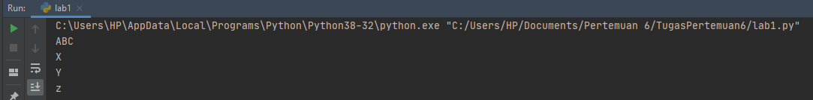
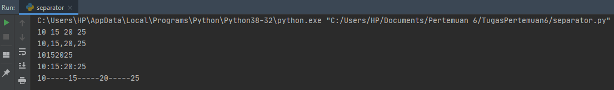
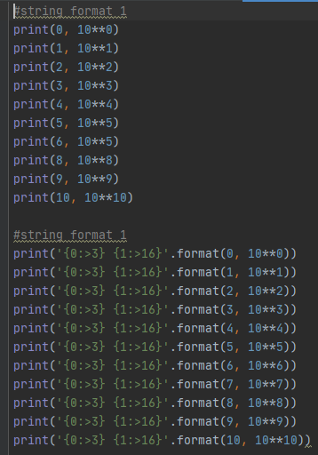
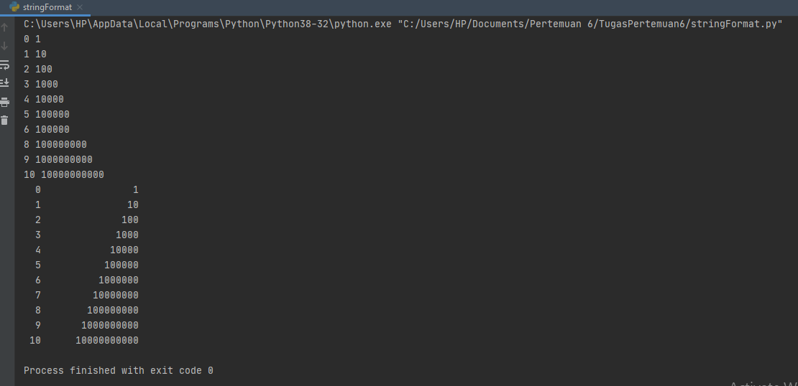
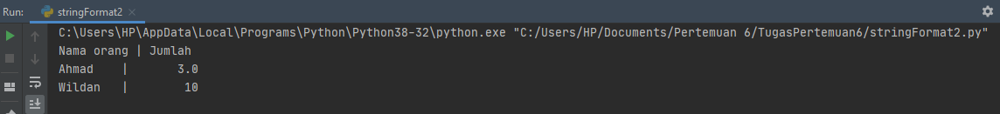

# **Tugas ini untuk melengkapi pertemuan ke 6**  
# **Dan menjelaskan project**

**Nama          : Ainul Yaqin**  
**NIM           : 312010423** 
**Kelas         : TI.20.A.1** 
**Mata Kuliah   : Bahasa Pemograman**

# **Lab 1**

Pada halaman ini (Tugas Pertemuan 6 - Lab 1) saya diberikan tugas oleh Dosen yaitu mempelajari operator aritmatika menggunakan bahasa Pemrograman pyhton. Berikut source code yang di berikan oleh dosen :

`#penggunaan end`  
`print('A', end='')`  
`print('B', end='')`  
`print('C', end='')`  
`print()`  
`print('X')`  
`print('Y')`  
`print('z')`  

`#Penggunaan separator` 
`w, x, y, z = 10, 15, 20, 25`  
`print(w, x, y, z)`  
`print(w, x, y, z, sep=',')`  
`print(w, x, y, z, sep='')`  
`print(w, x, y, z, sep=':')`  
`print(w, x, y, z, sep='.....')`  

Baik, berikutnya saya akan menjelaskan tentang materi yang diberikan oleh dosen.

* Penggunaan END Penggunaan end digunakan untuk menambahkan karakter yang dicetak di akhir baris. secara default penggunaan end adalah untuk ganti baris.

`print('A', end='')`  
`print('B', end='')`  
`print('C', end='')`  

`> Penggunaan print () digunakan untuk mencetak output, seperti syntax dibawah ini :`

`print()`

`>Syntax dibawah ini digunakan untuk menampilkan output berupa string`

`print('X')`  
`print('Y')`  
`print('z')`  

Hasil dari source code tersebut seperti gambar dibawah ini :

* Penggunaan Separator

`>Pendeklarasian beberapa variable beserta nilainya`

`w,x,y,z=10,15,20,25`  
`>Menampilkan hasil dari variable tiap-tiap variable`

`print(w,x,y,z)`  
`>Menampilkan hasil dari tiap-tiap variable dengan menggunakan pemisah : (koma)`

`print(w,x,y,z,sep=",")`  
`>Menampilkan hasil dari tiap-tiap variable dengan menggunakan pemisah`

`print(w,x,y,z,sep="")`  
`>Menampilkan hasil dari tiap-tiap variable dengan menggunakan pemisah : (titik dua)`

`print(w,x,y,z,sep=":")`  
`>Menampilkan hasil dari tiap-tiap variable dengan menggunakan pemisah`

`print(w,x,y,z,sep="-----")`

* Hasil dari syntax / source code diatas adalah seperti berikut ini :

* String Format

String formatting atau pemformatan string memungkinan kita menyuntikkan item kedalam string dari pada kita mencoba menggabungkan string menggunakan koma atau string concatenation.

* Penggunaan source code yang di berikan oleh dosen seperti berikut :  

`#string format 1`
`print(0, 10**0)`  
`print(1, 10**1)`  
`print(2, 10**2)`  
`print(3, 10**3)`  
`print(4, 10**4)`  
`print(5, 10**5)`  
`print(6, 10**5)`  
`print(8, 10**8)`  
`print(9, 10**9)`  
`print(10, 10**10)`  

`#string format 1`
`print('{0:>3} {1:>16}'.format(0, 10**0))`  
`print('{0:>3} {1:>16}'.format(1, 10**1))`  
`print('{0:>3} {1:>16}'.format(2, 10**2))`  
`print('{0:>3} {1:>16}'.format(3, 10**3))`  
`print('{0:>3} {1:>16}'.format(4, 10**4))`  
`print('{0:>3} {1:>16}'.format(5, 10**5))`  
`print('{0:>3} {1:>16}'.format(6, 10**6))`  
`print('{0:>3} {1:>16}'.format(7, 10**7))`  
`print('{0:>3} {1:>16}'.format(8, 10**8))`  
`print('{0:>3} {1:>16}'.format(9, 10**9))`  
`print('{0:>3} {1:>16}'.format(10, 10**10))`  

Saat ini saya akan membahas satu persatu dari syntax yang telah diberikan oleh Dosen.

**String Format 1**

Pada syntax / source code strring format satu akan menampilkan output berupa 2 outputan.  
Yang pertama (sebelah kiri) akan menampilkan angka urut dari angka 0 hingga 10, sedangkan untuk sebelah kanan akan menampilkan Operasi Aritmatika Pangkat.
Dengan ketentuan sebagai berikut, Operasi pangkat dengan angka kiri sebagai pokok (Rumus : ** [bintang dua] )  
Hasil dari syntax tersebut adalah 10 pangkat 0, hingga 10 pangkat 10, dengan output sebagai berikut :  

**String Format 2**

Pada syntax atau source code string format dua akan menampilkan output berupa 2 output'an juga (seperti String Format 1, yaitu kanan dan kiri )  
Dengan ketentuan sebagai berikut :

Secara Default, **.format()** menggunakan rata kiri, angka ke kanan. kita dapat menggunakan opsi opsional <,^, atau > untuk mengatur perataan kiri, tengah, atau kanan. Contoh lain dalam penggunaan **.format()** sebagai berikut :

`print('{0:8} | {1:9}'.format('Nama orang','Jumlah'))`  
`print('{0:8} | {1:9}'.format('Ahmad',3.))`  
`print('{0:8} | {1:9}'.format('Wildan',10))`  

Hasil dari source code contoh diatas akan seperti berikut :  

